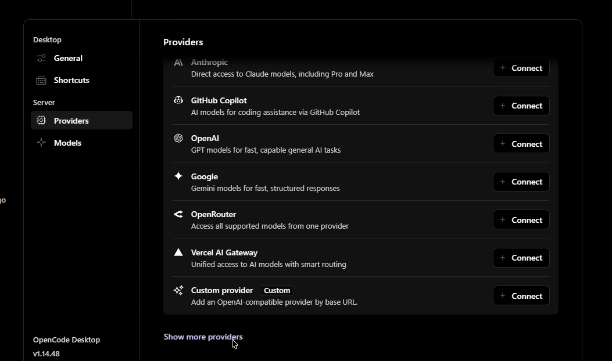
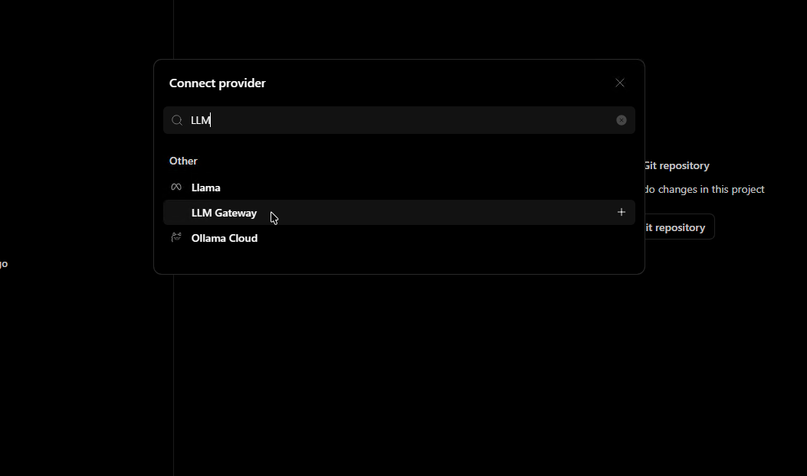
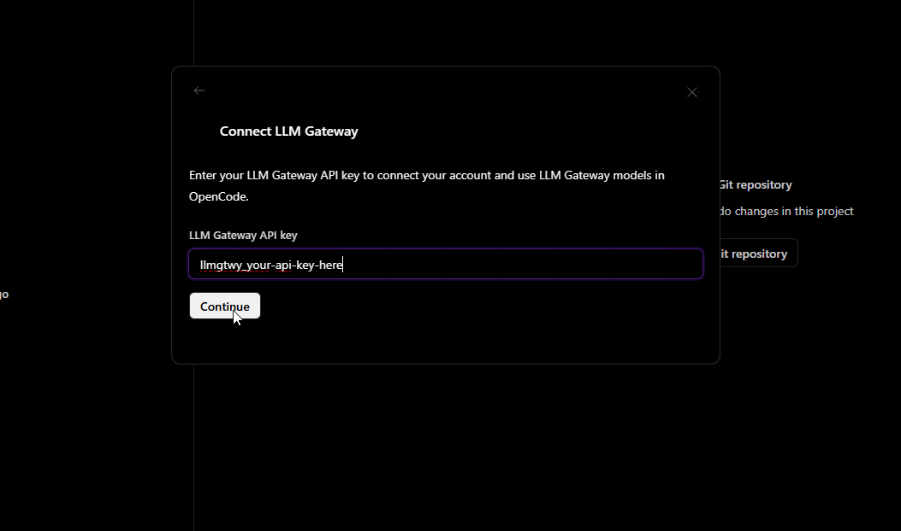
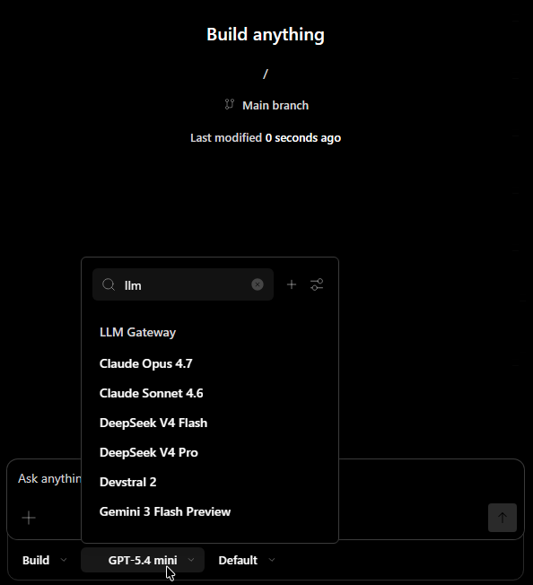
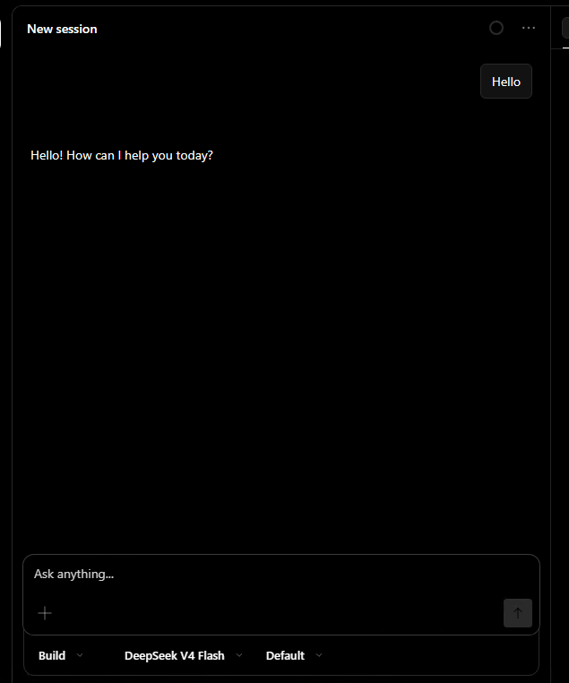

import { Step, Steps } from "fumadocs-ui/components/steps";
import { Callout } from "fumadocs-ui/components/callout";

[OpenCode Desktop](https://opencode.ai/download) is the GUI desktop app version of OpenCode — an open-source AI coding agent with a full visual interface for managing providers, models, and sessions. betarouter is a built-in provider, so setup takes under a minute with no config files required.

<Callout type="info">
	Looking for the CLI version? See the [OpenCode CLI guide](/guides/opencode).
</Callout>

## Prerequisites

- OpenCode Desktop installed — [download for Windows or macOS](https://opencode.ai/download)
- An betarouter API key — [sign up free](https://betarouter.com/signup) (no credit card required)

## Installation

Download OpenCode Desktop from [opencode.ai/download](https://opencode.ai/download) and install it for your platform:

- **macOS (Apple Silicon)** — `.dmg` installer
- **macOS (Intel)** — `.dmg` installer
- **Windows** — `.exe` installer

You can also install on macOS via Homebrew:

```bash
brew install --cask opencode-desktop
```

## Setup

<Steps>
<Step>
### Open Providers Settings

Launch OpenCode Desktop. Click the **Providers** section in the left sidebar under **Server**. You'll see the list of built-in providers:



</Step>

<Step>
### Find betarouter

Click **Show more providers** at the bottom of the list, or click **+ Connect** on any entry to open the provider search. Type `LLM` in the search box — **betarouter** will appear under "Other":



Select **betarouter** from the list.

</Step>

<Step>
### Enter Your API Key

OpenCode will show the **Connect betarouter** dialog. Paste your betarouter API key (starts with `llmgtwy_`) and click **Continue**:



[Sign up](https://betarouter.com/signup) or log in to your betarouter dashboard and navigate to **API Keys** to get your key.

</Step>

<Step>
### Select a Model

Once connected, open the model picker from the chat input bar. Type `llm` to filter betarouter models — you'll see all available models including Claude Opus 4.7, Claude Sonnet 4.6, DeepSeek, Gemini, and more:



</Step>

<Step>
### Start Building

Select a model and start chatting. All requests route through betarouter — you'll see usage, costs, and logs in your [dashboard](https://betarouter.com/dashboard):



</Step>
</Steps>

## Why Use betarouter with OpenCode Desktop

- **200+ models** — Claude, GPT, Gemini, Llama, DeepSeek, and more from 40+ providers
- **One API key** — Stop managing separate keys for each provider
- **Cost tracking** — See exactly what each session costs in your dashboard
- **Response caching** — Repeated requests hit cache automatically
- **Automatic fallback** — If a provider is down, requests route to an alternative
- **Volume discounts** — Check [discounted models](https://betarouter.com/models?discounted=true) for savings up to 90%

## Switching Models

You can switch models at any time from the model picker in the chat input bar. Click the current model name, type `llm` to filter to betarouter models, and select a new one. The switch takes effect immediately for the next message.

## Locking to a Specific Provider

By default, betarouter automatically fails over to alternative providers if your chosen provider is experiencing downtime. To disable fallback for a specific model, you can pass the `X-No-Fallback` header via a custom `opencode.json` in your project root:

```json
{
	"provider": {
		"betarouter": {
			"options": {
				"headers": {
					"X-No-Fallback": "true"
				}
			}
		}
	}
}
```

<Callout type="warn">
	Disabling fallback means requests will fail if the chosen provider is down.
	See the [routing docs](/features/routing) for details.
</Callout>

## Troubleshooting

### betarouter doesn't appear in provider list

Click **Show more providers** at the bottom of the Providers page to expand the full list, then search for "LLM".

### Authentication errors

Make sure your API key starts with `llmgtwy_` and is active. Check your [dashboard](https://betarouter.com/dashboard) to confirm the key is valid.

### Models not loading after connect

Try disconnecting and reconnecting the provider from Settings > Providers. If models still don't load, check your internet connection and verify the key is valid.

<Callout type="info">
	View all available models on the [models page](https://betarouter.com/models).
</Callout>

<Callout type="info">
	Need help? Join our [Discord community](https://betarouter.com/discord) for
	support and troubleshooting assistance.
</Callout>
